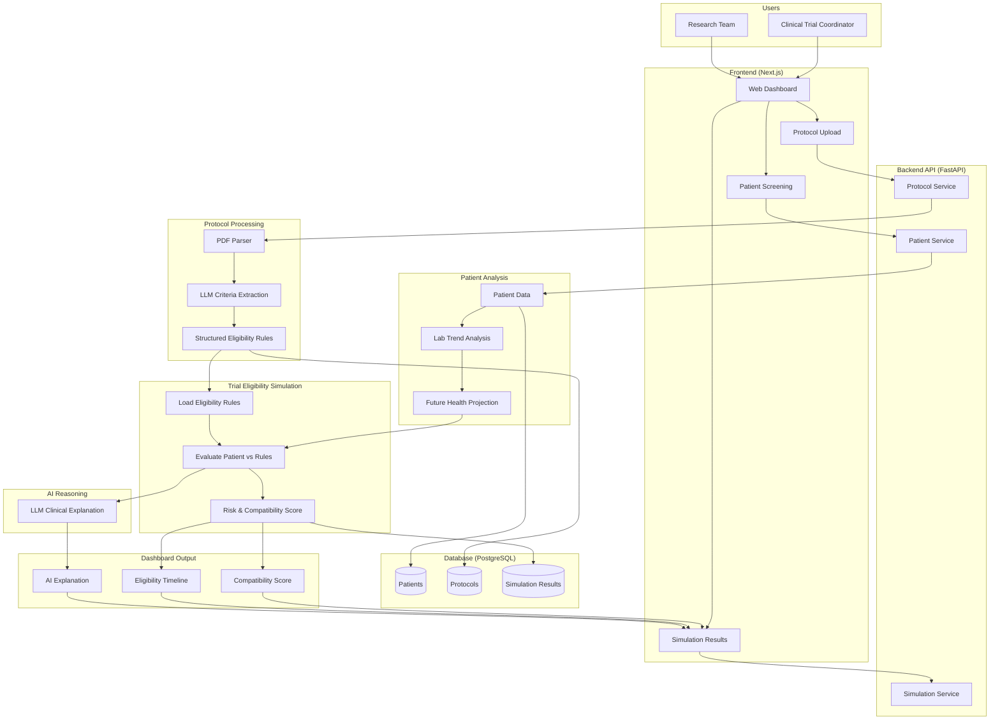

```mermaid

flowchart TB

%% ===============================
%% USERS
%% ===============================

subgraph USERS["Users"]

U1[Clinical Trial Coordinator]
U2[Research Team]

end


%% ===============================
%% FRONTEND
%% ===============================

subgraph FRONTEND["Frontend (Next.js)"]

F1[Web Dashboard]
F2[Protocol Upload]
F3[Patient Screening]
F4[Simulation Results]

end

U1 --> F1
U2 --> F1

F1 --> F2
F1 --> F3
F1 --> F4


%% ===============================
%% BACKEND API
%% ===============================

subgraph BACKEND["Backend API (FastAPI)"]

B1[Patient Service]
B2[Protocol Service]
B3[Simulation Service]

end

F2 --> B2
F3 --> B1
F4 --> B3


%% ===============================
%% PROTOCOL PROCESSING
%% ===============================

subgraph PROTOCOL["Protocol Processing"]

P1[PDF Parser]
P2[LLM Criteria Extraction]
P3[Structured Eligibility Rules]

end

B2 --> P1
P1 --> P2
P2 --> P3


%% ===============================
%% PATIENT ANALYSIS
%% ===============================

subgraph PATIENT_ANALYSIS["Patient Analysis"]

A1[Patient Data]
A2[Lab Trend Analysis]
A3[Future Health Projection]

end

B1 --> A1
A1 --> A2
A2 --> A3


%% ===============================
%% TRIAL SIMULATION
%% ===============================

subgraph SIMULATION["Trial Eligibility Simulation"]

S1[Load Eligibility Rules]
S2[Evaluate Patient vs Rules]
S3[Risk & Compatibility Score]

end

P3 --> S1
A3 --> S2
S1 --> S2
S2 --> S3


%% ===============================
%% AI REASONING
%% ===============================

subgraph AI["AI Reasoning"]

AI1[LLM Clinical Explanation]

end

S2 --> AI1


%% ===============================
%% STORAGE
%% ===============================

subgraph DATABASE["Database (PostgreSQL)"]

DB1[(Patients)]
DB2[(Protocols)]
DB3[(Simulation Results)]

end

A1 --> DB1
P3 --> DB2
S3 --> DB3


%% ===============================
%% OUTPUT
%% ===============================

subgraph OUTPUT["Dashboard Output"]

O1[Compatibility Score]
O2[Eligibility Timeline]
O3[AI Explanation]

end

S3 --> O1
S3 --> O2
AI1 --> O3

O1 --> F4
O2 --> F4
O3 --> F4
```
