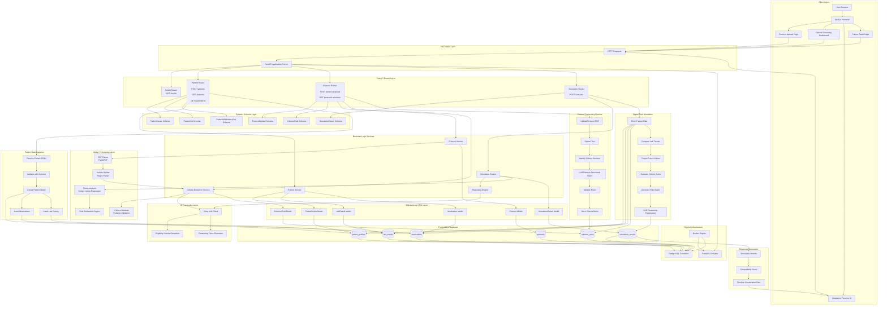

```mermaid

flowchart TB

%% ===============================
%% CLIENT LAYER
%% ===============================

subgraph CLIENT_LAYER["Client Layer"]

A[User Browser]
B[Next.js Frontend]
C[Protocol Upload Page]
D[Patient Screening Dashboard]
E[Simulation Timeline UI]
F[Patient Detail Page]

end

A --> B
B --> C
B --> D
B --> E
B --> F


%% ===============================
%% API COMMUNICATION
%% ===============================

subgraph API_COMMUNICATION["HTTP REST API"]

G[HTTP Requests]
H[FastAPI Application Server]

end

C --> G
D --> G
E --> G
F --> G

G --> H


%% ===============================
%% ROUTER LAYER
%% ===============================

subgraph ROUTER_LAYER["FastAPI Router Layer"]

R1[Health Router<br>GET /health]

R2[Patient Router<br>
POST /patients<br>
GET /patients<br>
GET /patients/:id]

R3[Protocol Router<br>
POST /protocol/upload<br>
GET /protocol/:id/criteria]

R4[Simulation Router<br>
POST /simulate]

end

H --> R1
H --> R2
H --> R3
H --> R4


%% ===============================
%% SCHEMA LAYER
%% ===============================

subgraph SCHEMA_LAYER["Pydantic Schema Layer"]

S1[PatientCreate Schema]
S2[PatientOut Schema]
S3[PatientWithHistoryOut Schema]
S4[ProtocolUpload Schema]
S5[CriterionRule Schema]
S6[SimulationResult Schema]

end

R2 --> S1
R2 --> S2
R2 --> S3
R3 --> S4
R3 --> S5
R4 --> S6


%% ===============================
%% SERVICE LAYER
%% ===============================

subgraph SERVICE_LAYER["Business Logic Services"]

SV1[Patient Service]
SV2[Protocol Service]
SV3[Criteria Extraction Service]
SV4[Simulation Engine]
SV5[Reasoning Engine]

end

R2 --> SV1
R3 --> SV2
R3 --> SV3
R4 --> SV4
SV4 --> SV5


%% ===============================
%% UTILITY LAYER
%% ===============================

subgraph UTILITY_LAYER["Utility / Processing Layer"]

U1[PDF Parser<br>PyMuPDF]
U2[Section Splitter<br>Regex Parser]
U3[Criteria Validator<br>Pydantic Validation]
U4[Trend Analyzer<br>Numpy Linear Regression]
U5[Rule Evaluation Engine]

end

SV2 --> U1
U1 --> U2
U2 --> SV3
SV3 --> U3

SV4 --> U4
U4 --> U5


%% ===============================
%% AI / LLM LAYER
%% ===============================

subgraph AI_LAYER["AI Processing Layer"]

AI1[Groq LLM Client]
AI2[Eligibility Criteria Extraction]
AI3[Reasoning Trace Generator]

end

SV3 --> AI1
AI1 --> AI2

SV5 --> AI1
AI1 --> AI3


%% ===============================
%% ORM / DATABASE LAYER
%% ===============================

subgraph ORM_LAYER["SQLAlchemy ORM Layer"]

ORM1[PatientProfile Model]
ORM2[LabResult Model]
ORM3[Medication Model]
ORM4[Protocol Model]
ORM5[CriterionRule Model]
ORM6[SimulationResult Model]

end

SV1 --> ORM1
SV1 --> ORM2
SV1 --> ORM3

SV2 --> ORM4
SV3 --> ORM5

SV4 --> ORM6


%% ===============================
%% DATABASE
%% ===============================

subgraph DATABASE["PostgreSQL Database"]

DB1[(patient_profiles)]
DB2[(lab_results)]
DB3[(medications)]
DB4[(protocols)]
DB5[(criterion_rules)]
DB6[(simulation_results)]

end

ORM1 --> DB1
ORM2 --> DB2
ORM3 --> DB3
ORM4 --> DB4
ORM5 --> DB5
ORM6 --> DB6


%% ===============================
%% DOCKER INFRASTRUCTURE
%% ===============================

subgraph INFRASTRUCTURE["Docker Infrastructure"]

D1[Docker Engine]
D2[FastAPI Container]
D3[PostgreSQL Container]

end

H --> D2

DB1 --> D3
DB2 --> D3
DB3 --> D3
DB4 --> D3
DB5 --> D3
DB6 --> D3

D1 --> D2
D1 --> D3


%% ===============================
%% DATA FLOW: PROTOCOL PROCESSING
%% ===============================

subgraph PROTOCOL_FLOW["Protocol Processing Pipeline"]

PF1[Upload Protocol PDF]
PF2[Extract Text]
PF3[Identify Criteria Sections]
PF4[LLM Extracts Structured Rules]
PF5[Validate Rules]
PF6[Store Criteria Rules]

end

R3 --> PF1
PF1 --> PF2
PF2 --> PF3
PF3 --> PF4
PF4 --> PF5
PF5 --> PF6
PF6 --> DB5


%% ===============================
%% DATA FLOW: PATIENT INGESTION
%% ===============================

subgraph PATIENT_FLOW["Patient Data Ingestion"]

PA1[Receive Patient JSON]
PA2[Validate with Schema]
PA3[Create Patient Model]
PA4[Insert Medications]
PA5[Insert Lab History]

end

R2 --> PA1
PA1 --> PA2
PA2 --> PA3

PA3 --> DB1
PA3 --> PA4
PA4 --> DB3

PA3 --> PA5
PA5 --> DB2


%% ===============================
%% DATA FLOW: SIMULATION ENGINE
%% ===============================

subgraph SIMULATION_FLOW["Digital Twin Simulation"]

SM1[Fetch Patient Data]
SM2[Compute Lab Trends]
SM3[Project Future Values]
SM4[Evaluate Criteria Rules]
SM5[Generate Risk Matrix]
SM6[LLM Reasoning Explanation]

end

R4 --> SM1

SM1 --> DB1
SM1 --> DB2
SM1 --> DB3
SM1 --> DB5

SM1 --> SM2
SM2 --> SM3
SM3 --> SM4
SM4 --> SM5
SM5 --> SM6

SM6 --> DB6


%% ===============================
%% RESPONSE FLOW
%% ===============================

subgraph RESPONSE_FLOW["Response Generation"]

RE1[Simulation Results]
RE2[Compatibility Score]
RE3[Timeline Visualization Data]

end

DB6 --> RE1
RE1 --> RE2
RE2 --> RE3
RE3 --> E
```
